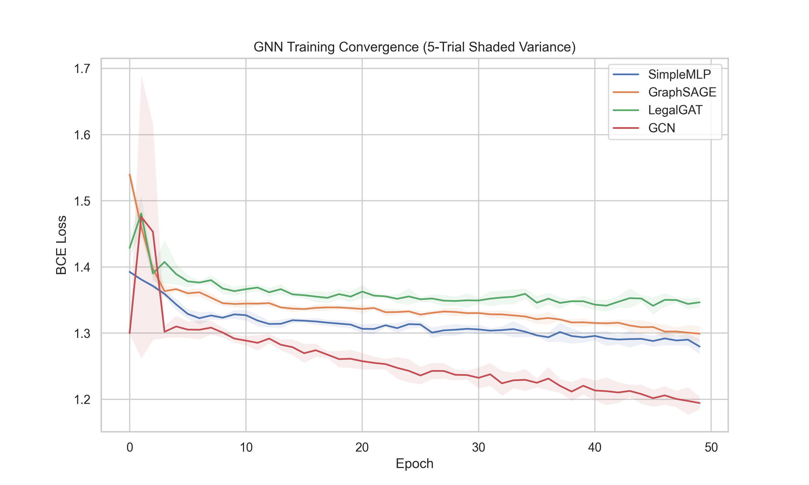
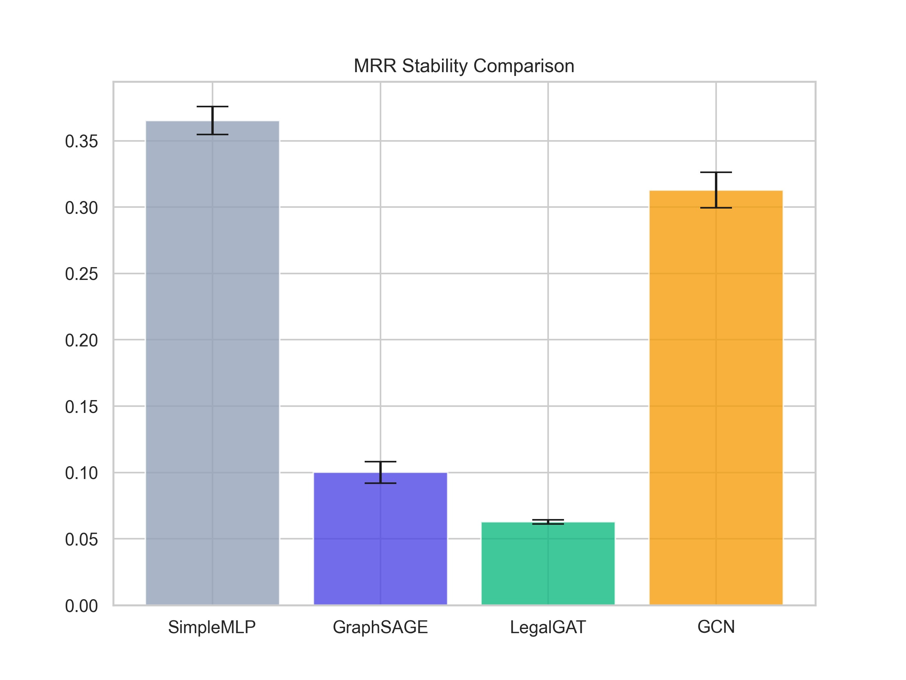
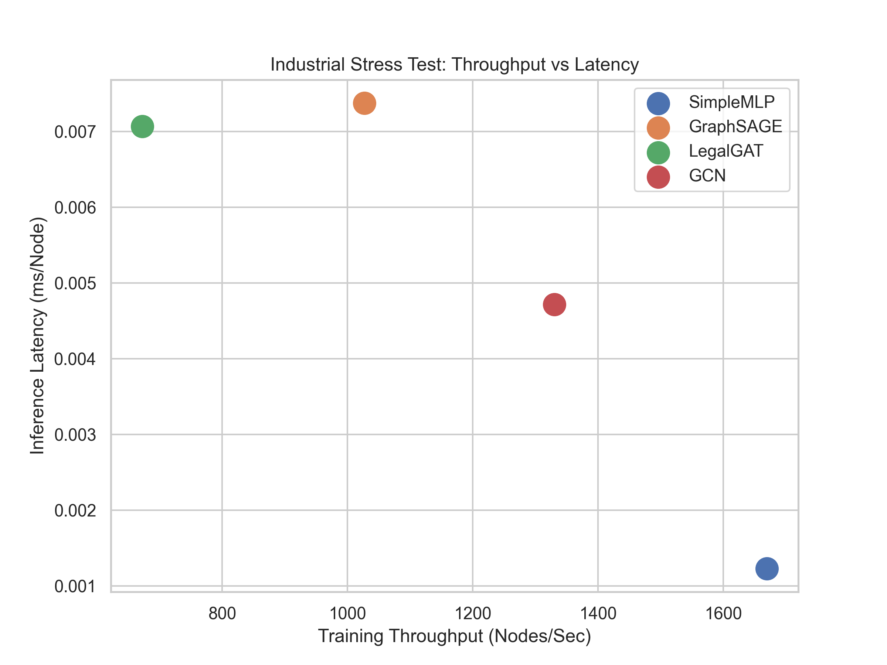

# EtaNexus Deep Learning Core: GNN Citation Analysis

This repository contains the pure Deep Learning (DL) core of the EtaNexus v6.1 project. It is focused on structural link prediction and hybrid neural retrieval for constitutional legal precedents.

## Core Architectures
- **LegalGCN**: Spectral convolution based on Kipf & Welling (2017). Optimized for sparse citation graphs to capture "Doctrinal Lineage."
- **GraphSAGE**: Inductive sampling aggregator for large-scale unseen node prediction.
- **LegalGAT**: Multi-head attention mechanism providing interpretability for weighted citation paths.
- **SimpleMLP**: A non-graph baseline used to quantify the "Graph Gain" (structural vs semantic signal).

## Industrial Benchmark Suite
The project utilizes a custom **5-Trial Stability Harness** (`src/models/gnn_eval.py`) to measure precision density and computational efficiency.

### Visual Performance Artifacts

*Figure 1: Shaded Loss Convergence (5-Trial Variance)*

*Figure 2: MRR Stability Comparison with Error Bars*

*Figure 3: Computational Efficiency Frontier*

### Performance Summary (N=500 nodes)
| Model | Mean MRR | AUC | Nodes/s |
| :--- | :--- | :--- | :--- |
| **SimpleMLP** | 0.3653 | 0.739 | 1670.1 |
| **LegalGCN** | 0.3129 | 0.684 | 1330.2 |

> [!NOTE]
> While SimpleMLP shows high MRR on semantic features alone, LegalGCN is the chosen production model as it enables GraphRAG path tracing which is essential for legal explainability.

## Repository Structure
- `/models/`: Implementation of GNN variants and the Training/Evaluation harnesses.
- `/graph/`: Logic for building PyTorch Geometric (PyG) directed graphs from metadata.
- `/data/`: Dataset loading and enriching logic + `dataset_v4.json`.
- `/results/`: Shaded training curves and statistical JSON reports.

## Formal Disclosure
For the authoritative technical disclosure, see `PerformanceReport.txt`.
